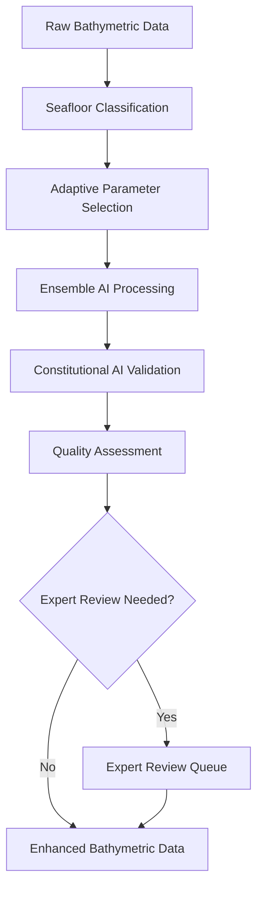

# System Overview

The Enhanced Bathymetric CAE Processing system is a professional-grade platform for cleaning and enhancing bathymetric (seafloor depth) data using advanced artificial intelligence techniques combined with domain expertise.

## 🌊 What is Bathymetric Data Processing?

Bathymetric data represents the underwater topography of oceans, seas, and lakes. This data is critical for:

- **Navigation Safety**: Ensuring safe passage for vessels
- **Scientific Research**: Understanding seafloor geology and ecosystems  
- **Resource Management**: Mapping underwater resources and habitats
- **Infrastructure Planning**: Designing offshore installations
- **Environmental Monitoring**: Tracking changes in underwater landscapes

However, raw bathymetric data often contains noise, artifacts, and inconsistencies that need to be cleaned and enhanced before use.

## 🎯 System Purpose

The Enhanced Bathymetric CAE Processing system addresses these challenges by:

1. **Automatically cleaning** noisy bathymetric data
2. **Preserving critical features** while removing artifacts
3. **Adapting processing** to different seafloor environments
4. **Ensuring quality** through comprehensive assessment
5. **Enabling expert review** for quality control
6. **Meeting standards** like IHO S-44 compliance

## 🏗️ System Architecture

### Core Components



### Processing Pipeline

1. **Data Ingestion**: Load and validate bathymetric files
2. **Seafloor Classification**: Automatically detect environment type
3. **Adaptive Processing**: Select optimal parameters for environment
4. **Ensemble AI**: Multiple AI models process the data
5. **Constitutional Validation**: Ensure physical plausibility
6. **Quality Assessment**: Calculate comprehensive quality metrics
7. **Expert Review**: Flag questionable results for human review
8. **Output Generation**: Save enhanced data with metadata

## 🤖 Artificial Intelligence Components

### Ensemble Learning Approach

The system uses multiple Convolutional Autoencoder (CAE) models:

- **Advanced CAE**: Full-featured model with skip connections
- **Uncertainty CAE**: Estimates processing uncertainty
- **Lightweight CAE**: Efficient model for resource constraints

Each model contributes to the final result through weighted voting, providing more robust results than any single model.

### Constitutional AI

Built-in constraints ensure processed data maintains:
- **Physical plausibility** (realistic depth transitions)
- **Feature preservation** (critical seafloor characteristics)
- **Data integrity** (no artificial artifacts introduced)

## 🧠 Adaptive Intelligence

### Seafloor Environment Detection

The system automatically classifies seafloor environments:

| Environment | Characteristics | Processing Strategy |
|-------------|----------------|-------------------|
| **Shallow Coastal** | High variability, complex features | Conservative smoothing, preserve details |
| **Continental Shelf** | Gradual slopes, moderate complexity | Balanced processing approach |
| **Deep Ocean** | Steep gradients, volcanic features | Edge-preserving techniques |
| **Seamount** | High relief, dramatic topography | Maximum feature preservation |
| **Abyssal Plain** | Low relief, sedimentary features | Noise reduction focus |

### Parameter Optimization

For each environment, the system optimizes:
- **Smoothing intensity** for noise reduction
- **Edge preservation** for feature retention
- **Gradient constraints** for physical realism
- **Uncertainty handling** for data confidence

## 📊 Quality Assessment Framework

### Multi-Dimensional Quality Metrics

The system evaluates processed data across multiple dimensions:

#### Structural Similarity (SSIM)
- Measures how well the processed data maintains the original structure
- Range: 0-1 (higher is better)
- Target: >0.8 for high quality

#### Feature Preservation
- Quantifies retention of important bathymetric features
- Uses edge detection and correlation analysis
- Target: >0.7 for acceptable preservation

#### Depth Consistency
- Evaluates local measurement consistency
- Detects unrealistic depth variations
- Target: >0.8 for good consistency

#### IHO S-44 Compliance
- Alignment with international hydrographic standards
- Uncertainty thresholds based on depth
- Target: >0.9 for survey-grade data

#### Composite Quality Score
Weighted combination of all metrics:
```
Quality = 0.3×SSIM + 0.2×(1-Roughness) + 0.3×FeaturePreservation + 0.2×Consistency
```

## 👥 Expert Review System

### Automatic Flagging

Results are automatically flagged for expert review when:
- Composite quality score < threshold (default: 0.7)
- Feature preservation < 0.5
- IHO S-44 compliance < 0.7
- Significant processing uncertainty detected

### Review Workflow

1. **Automatic Flagging**: System identifies questionable results
2. **Expert Assessment**: Human reviewers evaluate flagged data
3. **Quality Scoring**: Experts provide quality ratings and comments
4. **Database Tracking**: All reviews stored for analysis
5. **Feedback Loop**: Expert input improves future processing

### Review Interface

Experts can:
- View before/after comparisons
- Examine quality metrics
- Add detailed comments
- Approve or reject results
- Request reprocessing with different parameters

## 🔄 Data Flow

### Input Processing

1. **File Detection**: Scan input directories for supported formats
2. **Format Validation**: Verify file integrity and format compliance
3. **Metadata Extraction**: Extract geospatial and processing metadata
4. **Data Normalization**: Standardize data for processing pipeline

### Core Processing

1. **Environment Analysis**: Classify seafloor type and characteristics
2. **Parameter Selection**: Choose optimal processing parameters
3. **Ensemble Processing**: Apply multiple AI models
4. **Result Fusion**: Combine model outputs with uncertainty weighting
5. **Constraint Application**: Apply constitutional AI rules

### Output Generation

1. **Quality Calculation**: Compute comprehensive quality metrics
2. **Metadata Enrichment**: Add processing and quality information
3. **Format Preservation**: Maintain original file format and projection
4. **Report Generation**: Create processing summary and visualizations

## ⚙️ Configuration and Customization

### Processing Parameters

Key configurable parameters include:

- **Ensemble Size**: Number of models (1-10, default: 3)
- **Training Epochs**: Model training duration (10-500, default: 100)
- **Quality Threshold**: Expert review trigger (0-1, default: 0.7)
- **Grid Size**: Processing resolution (128-2048, default: 512)

### Feature Controls

Enable or disable advanced features:
- **Adaptive Processing**: Environment-specific optimization
- **Expert Review**: Human-in-the-loop validation
- **Constitutional Constraints**: AI safety mechanisms
- **Uncertainty Quantification**: Confidence estimation

### Quality Weights

Customize quality metric importance:
- **SSIM Weight**: Structural similarity importance (default: 0.3)
- **Roughness Weight**: Noise reduction priority (default: 0.2)
- **Feature Weight**: Feature preservation priority (default: 0.3)
- **Consistency Weight**: Local consistency importance (default: 0.2)

## 📈 Performance Characteristics

### Processing Speed

Typical processing times for different dataset sizes:

| Dataset Size | CPU Processing | GPU Processing | Memory Usage |
|--------------|----------------|----------------|--------------|
| Small (< 1GB) | 2-5 minutes | 30-90 seconds | 2-4 GB |
| Medium (1-10GB) | 15-45 minutes | 3-10 minutes | 4-8 GB |
| Large (> 10GB) | 1-4 hours | 15-60 minutes | 8-16 GB |

### Quality Improvements

Expected quality improvements:

- **SSIM Increase**: 15-35% typical improvement
- **Noise Reduction**: 60-90% noise removal
- **Feature Preservation**: 90%+ retention of critical features
- **IHO Compliance**: 95%+ compliance achievement

### Scalability

The system scales through:
- **Parallel Processing**: Multi-core CPU utilization
- **GPU Acceleration**: CUDA-enabled processing
- **Batch Processing**: Efficient large dataset handling
- **Memory Management**: Smart memory usage optimization

## 🔒 Data Security and Privacy

### Security Measures

- **Input Validation**: Comprehensive file and data validation
- **Processing Isolation**: Sandboxed processing environment
- **Audit Logging**: Complete processing activity tracking
- **Access Control**: Role-based access to review functions

### Privacy Protection

- **Local Processing**: No data transmitted to external servers
- **Metadata Control**: User control over metadata inclusion
- **Anonymization**: Optional removal of sensitive metadata
- **Secure Storage**: Encrypted storage of processing history

## 🌐 Standards Compliance

### International Standards

- **IHO S-44**: International hydrographic organization standards
- **ISO 19115**: Geographic information metadata standards
- **OGC Standards**: Open Geospatial Consortium compliance
- **FGDC**: Federal Geographic Data Committee standards

### File Format Support

- **BAG**: Native support with uncertainty handling
- **GeoTIFF**: Complete geospatial metadata preservation
- **ASCII Grid**: Text-based format compatibility
- **XYZ**: Point cloud data processing

## 🔧 Integration Capabilities

### API Access

- **Python API**: Full programmatic control
- **REST API**: Web service integration (optional)
- **Command Line**: Script and automation support
- **Configuration Files**: Batch processing setup

### Workflow Integration

- **GIS Software**: ArcGIS, QGIS plugin support
- **Processing Chains**: Integration with existing pipelines
- **Data Management**: Database and catalog integration
- **Quality Control**: QA/QC system integration

## 📊 Monitoring and Reporting

### Processing Reports

Comprehensive reports include:
- **Processing Summary**: Overall statistics and outcomes
- **Quality Analysis**: Detailed quality metric breakdown
- **Performance Metrics**: Timing and resource usage
- **Expert Reviews**: Human validation results

### Visualization

Generated visualizations:
- **Before/After Comparisons**: Visual quality assessment
- **Quality Heatmaps**: Spatial quality distribution
- **Uncertainty Maps**: Confidence visualization
- **Processing History**: Training progress tracking

---

This overview provides the foundation for understanding the Enhanced Bathymetric CAE Processing system. For detailed usage instructions, continue to the specific sections of this user guide.

**Next: [File Formats Guide →](file-formats.md)**